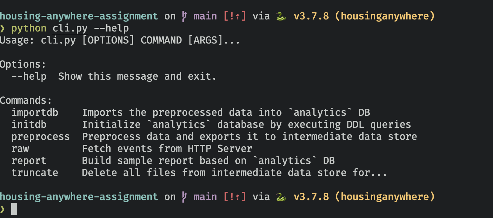
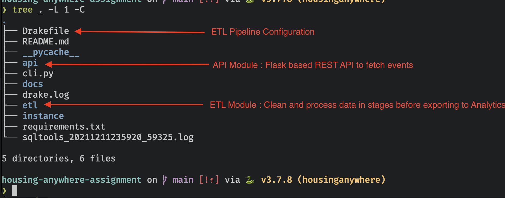
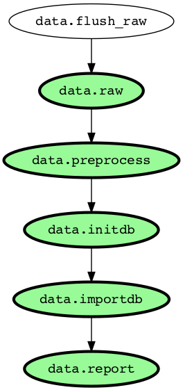
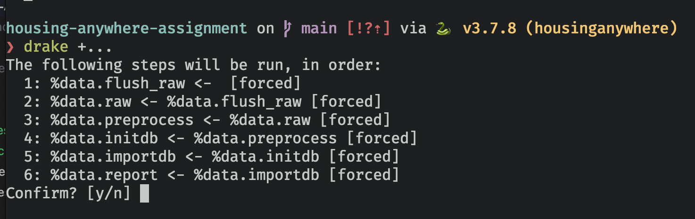

# HousingAnywhere Assignment

## Overview

- API
  - Flask based REST API to fetch events. The endpoint supports returning event between certain time period.
  - Stored the `events_data.json` data into a SQLite DB to simplify query filtering with the API.
  - `api/schema.sql` has DDL queries to create an events storage table
- ETL
  - Implemented a multi-stage ETL pipeline to periodically fetch events using the REST API, clean and preprocess the data before exporting to Analytics DB
  - `etl/schema.sql` has all the DDL queries required to create tables in Analytics DB
  - The Analytics DB followed the Kimball Methodology to model the data into fact-dimension tables.
  - Implement sample report to fetch data from Analytics DB (Bonus)
  - ETL pipeline configured using [drake](https://github.com/Factual/drake) (Bonus)

## Usage

### Setup Instructions

Project requires `Python 3.7.8`

- Create a virtualenv specifically for this project. This can be created using `pyenv` and [pyenv-virtualenv](https://github.com/pyenv/pyenv-virtualenv) packages. This can be installed using `brew`.

```bash
brew install pyenv
brew install pyenv-virtualenv
# Go to the directory where this code is kept.
# Right way to check whether you are in correct directory or not is to ensure README.md is at the root of it
# Assuming code is kept in `/codes/` directory
cd /codes/housing-anywhere-assignment/

# Create virtualenv
pyenv virtualenv 3.7.8 housinganywhere
pyenv local housinganywhere
```

NOTE: All subsequent steps mentioned in the document assumes that virtualenv is activated

- Install requirements

```bash
pip install -r requirements.txt
```

- Run the following command to initialised the API's SQLite DB

```bash
FLASK_APP=api FLASK_ENV=development flask initdb
```

- Run the following command to run the Flask based API

```bash
FLASK_APP=api FLASK_ENV=development flask run
```

- Open up a separate terminal window, activate the virtualenv and execute following command. The `cli.py` script in the
  root directory acts as an interface to trigger various ETL stages. The following command will show all possible subcommands.

```bash
python cli.py --help
```

<details markdown="1">
<summary>Screenshot</summary>



</details>

NOTE: The entire ETL pipeline can be triggered at once using a single command. Please refer to [Trigger ETL Pipeline](#trigger-etl-pipeline) section for more details.

### Project Structure

The project is divided into two main components, which are `api` and `etl`. The `api` module is Flask based REST API which returns events from the DB. It supports fetching events happened between certain timeperiod. The `etl` module implements all the stages of ETL pipeline.



### Trigger ETL Pipeline



Install pre-requisites using following commands

```bash
brew install drake graphviz
```

- Trigger the pipeline

```bash
drake +...
```

It shows the order in which stages will run and their interdependency. Type `y` in the prompt to execute it

<details markdown="1">
<summary>Screenshot</summary>



</details>

## Documentation

- 
