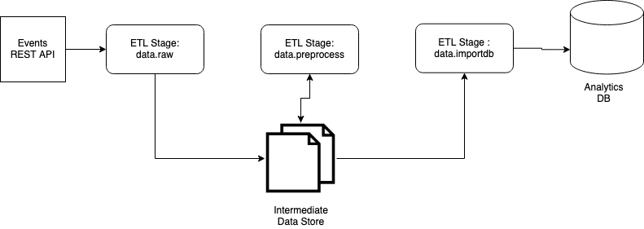
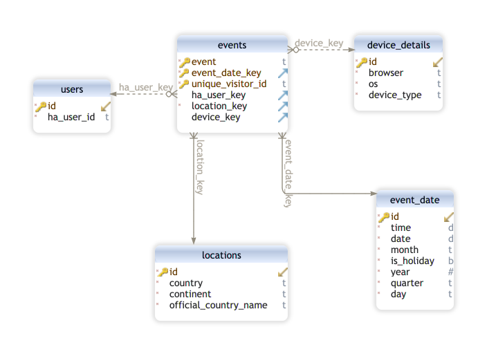

# ETL Design Decisions

## ETL Stages / Pipeline

The entire ETL processs is divided into multiple stages. This division is done on basis of the responsibilities of each stage and the resources they interact with and uses during the process. The following diagram shows all ETL stages in the order of their execution. This diagram can be referred as ETL pipeline of this project.

_Question : Why the ETL is divided into multiple stages?_  
_Answer :_ Consider an example, the `data.raw` stages interacts with REST API while the `data.preprocess` stage cleans and preprocess data to improve its quality and also to make data consumption easier. Having this separate stages gives freedom to scale them separately as they have very different resource requirements. The `data.raw` stage majorly involves handling Network I/O while the `data.preprocess` stage majorly uses CPU/Memory.

### Overview

The following diagram shows all components the ETL pipeline interacts with.

### Intermediate Data Store

The intermediate data store is basically `/tmp/housinganywhere_data/` directory. It stores data in `parquet` format. Both the `data.raw` , `data.preprocess` and `data.importdb` stages interact with this store.

_Question : Why data is being stored in parquet format?_  
_Answer :_ `parquet` is a columnar data format i.e if data consumption involves fetching multiple columns (with all rows) rather than multiple rows (with all columns) it will perform better and also save memory. Also, it stores the data with snappy compression which performs better compared to more commonly known formats like gzip. One more benefit of using parquet is it supports partitioning data which makes the data consumption efficient. Due to this, the ETL is divided into multiple stages so that they can be run and scaled independently.

The following section talks about each of these ETL stages.

### ETL Stage : data.flush_raw

This stage uses the `flush` subcommand from the `cli.py`. Based on the paramter, it deletes all the files associated with that particular ETL Stage. This stage deletes all the files associated with `raw` stage if they already exists.

### ETL Stage : data.raw

It periodically fetches the events from the REST API and stores them in intermediate data store for the consumption by subsequent stages. Currently, it fetches the events data from API in every 5 minutes. This behaviour is currently mocked and can be checked in `Drakefile`.
It uses the `raw` subcommand from the `cli.py`, which accepts `start-time` and `end-time` as parameter. Based on these parameters it fetches the events between this time period.

### ETL Stage : data.preprocess

It reads all the `raw` stage specific data from the intermediate data store and performs cleaning to improve the quality of the data. The preprocess/cleaning involves following modifications,

- Cleanups the `country_code` column to have consistent full country name instead of country code or mixed values. For example, the raw events data has `US` as country code in some rows while `United States` in some rows. This check ensures all the rows belong to `US` or `United States` have `United States` as country.

- Add the `browser` and `os` details if we already know based on `unique_visitor_id`. The `unique_visitor_id` is assigned by the browser so it can be used as valid reference point to find the correct `browser` and `os` values

- Cleanup `ha_user_id` column to have numeric user id. For example, some rows in raw data has alphanumeric user id which is inconsistent.

- Fill `ha_user_id` based on `unique_visitor_id` if already known from the previous data

- Remove the inconsitent user identifier pairs i.e make sure `unique_visitor_id` should only belong to a single `ha_user_id`

### ETL Stage : data.initdb

Executes the DDL queries from the `etl/schema.sql` to create the tables in analytics database. The data model follows the Kimball Methodology and more details about it can be found in [Data Model](#data-model) section

### ETL Stage : data.importdb

It reads the preprocessed data from the intermediate data store and imports it into analytics database as bulk inserts.

### ETL Stage : data.report

It creates a sample report by running to two queries on the analytics database. The report has following data,

- Events Per Country
- Events by User Type (Authenticated / Unauthenticated)

## Data Model

The data modeling process follows the Kimball Methodology.

### Grain

In fact table, each row represents an event or interaction user done with the product via browser

### Facts

There is a fact table named `events`.

### Dimensions

There are 4 dimension tables in `analytics` database. Each table answer one question related to the facts table. Following table shows the name of these dimension tables along with the how they are related to facts table.

| Table Name     | Description                    |
| -------------- | ------------------------------ |
| device_details | `Who` did the event            |
| users          | `Who` did the event            |
| locations      | `Where` did the event happened |
| event_date     | `When` event happened          |
